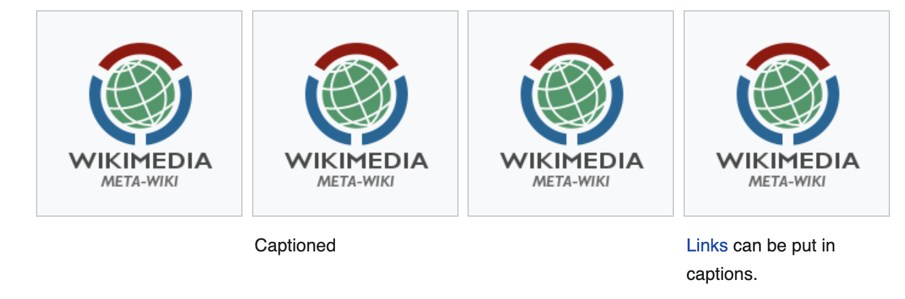
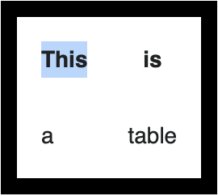

# Wikitext

This is a cheatsheet for wikitext [based off this document](wt-cheatsheet).
Its structure is based off of [this cheatsheet](md-cheatsheet) for markdown.

**Table of Contents**

[Headers](dfn-headers)<br>
[Emphasis](dfn-emphasis)<br>
[Lists](dfn-lists) ([unordered](dfn-ul), [ordered](dfn-ol), [definition](def-dfn-ls), [mixed](dfn-mixed-ls), [indentation](dfn-indentation))<br>
[Horizontal Rule](dfn-hr)<br>
[Footnotes](dfn-footnotes)<br>
[Links](dfn-links) ([internal](dfn-internal-links), [external](dfn-external-links))<br>
[Escaping](#escaping) <br>
[Code and Syntax Highlighting](dfn-code)<br>
[Media](#media) ([images](#images), [sound](#sound))<br>
[Tables](dfn-tables)<br>
[Math](#math)<br>
[HTML](dfn-html)<br>


## Headers

```
= H1 =
== H2 ==
=== H3 ===
==== H4 ====
===== H5 =====
====== H6 ======

```

# H1
## H2
### H3
#### H4
##### H5
###### H6

> **Note**: `h1` headings are reserved for page titles. They should not be used within page contents. 

## Emphasis
```
Emphasis, aka italics, with ''2 apostrophes''.

Strong emphasis, aka bold, with '''3 apostrophes'''.

Combined emphasis with '''''5 apostrophes'''''.

Strikethrough uses a html tag. <s>Scratch this.</s>
```

Emphasis, aka italics, with *2 apostrophes*.

Strong emphasis, aka bold, with **3 apostrophes**.

Combined emphasis with ***5 apostrophes***.

Strikethrough uses a html tag. ~~Scratch this.~~

## Lists

### Unordered Lists
```
* ''Unordered lists'' are easy to do:
** Start every line with a asterisk.
*** More asterisks indicate a deeper level.
*: Previous item continues.
** A newline
* in a list  
marks the end of the list.
*Of course you can start again.
```
- Unordered lists are easy to do:
  - Start every line with a asterisk.
    - More asterisks indicate a deeper level.<br>
      Previous item continues.
    - A newline
  - in a list
marks the end of the list.
- Of course you can start again.

### Ordered Lists
```
# ''Numbered lists'' are:
## Very organized
## Easy to follow
A newline marks the end of the list.
# New numbering starts with 1.
```

1. Numbered lists are:
  1. Very organized
  2. Easy to follow

A newline marks the end of the list.
1. New numbering starts with 1.

### Definition Lists
```
; Word : Definition of the word
; A longer phrase needing definition
: Phrase defined
; A word : Which has a definition
: Also a second definition
: And even a third
```

**Word**<br>
&nbsp;&nbsp;&nbsp;&nbsp;Definition of the word

**A longer phrase needing definition**<br>
&nbsp;&nbsp;&nbsp;&nbsp;Phrase defined

**A word**<br>
&nbsp;&nbsp;&nbsp;&nbsp;Which has a definition<br>
&nbsp;&nbsp;&nbsp;&nbsp;Also a second definition<br>
&nbsp;&nbsp;&nbsp;&nbsp;And even a third

Begin with a semicolon. One item per line; a newline can appear before the colon, but using a space before the colon improves parsing.

### Mixed Lists
```
* You can even do mixed lists
*# and nest them
*# inside each other
*#* or break lines<br>in lists.
*#; definition lists
*#: can be 
*#:; nested : too
```

- You can even do mixed lists
  1. and nest them
  2. inside each other
    - or break lines<br>
      in lists.<br>

&nbsp;&nbsp;&nbsp;&nbsp;definition lists<br>
&nbsp;&nbsp;&nbsp;&nbsp;&nbsp;&nbsp;&nbsp;&nbsp;can be<br>
&nbsp;&nbsp;&nbsp;&nbsp;&nbsp;&nbsp;&nbsp;&nbsp;**nested**<br>
&nbsp;&nbsp;&nbsp;&nbsp;&nbsp;&nbsp;&nbsp;&nbsp;&nbsp;&nbsp;&nbsp;&nbsp;too

> That last part probably didn't render correctly, but, hey, this is markdown, not wikitext. 

### Indentation

```
: A colon (:) indents a line or paragraph.
A newline starts a new paragraph.
Should only be used on talk pages.
For articles, you probably want the blockquote tag.
: We use 1 colon to indent once.
:: We use 2 colons to indent twice.
::: 3 colons to indent 3 times, and so on.
```
&nbsp;&nbsp;&nbsp;&nbsp;A colon (:) indents a line or paragraph.<br>
A newline starts a new paragraph.<br>
Should only be used on talk pages.<br>
For articles, you probably want the blockquote tag.

&nbsp;&nbsp;&nbsp;&nbsp;We use 1 colon to indent once.<br>
&nbsp;&nbsp;&nbsp;&nbsp;&nbsp;&nbsp;&nbsp;&nbsp;We use 2 colons to indent twice.<br>
&nbsp;&nbsp;&nbsp;&nbsp;&nbsp;&nbsp;&nbsp;&nbsp;&nbsp;&nbsp;&nbsp;&nbsp;3 colons to indent 3 times, and so on.


## Horizontal Rule
```
You can make ''horizontal dividing lines'' (----) to separate text.
----
But you should usually use sections instead, so that they go in the table of contents.
```

You can make horizontal dividing lines (----) to separate text.

---
But you should usually use sections instead, so that they go in the table of contents.


## Footnotes
```
You can add footnotes to sentences using
the ''ref'' tag -- this is especially good
for citing a source.

:There are over six billion people in the
world.<ref>CIA World Factbook, 2006.</ref>

References: <references/>

For details, see [[Wikipedia:Footnotes]] 
and [[Help:Footnotes]].
```

You can add footnotes to sentences using the *ref* tag -- this is especially good for citing a source.

&nbsp;&nbsp;&nbsp;&nbsp;There are over six billion people in the world.[[1]()]

References:
1. CIA World Factbook, 2006.

For details, see [Wikipedia:Footnotes](https://en.wikipedia.org/wiki/Note_(typography)) and [Help:Footnotes](https://meta.wikimedia.org/wiki/Help:Footnotes).


## Links

### Internal Links

```
Here's a link to a page named [[Official positions|Official position]].
Capitalization does not matter in the first letter, as in [[official positions]]

Here's a link to a section [[Doxygen#Doxygen Examples]]. When there are multiple sections with the same title, [[Doxygen#Doxygen Examples 3]] links to third section title "Doxygen Examples".

This is a [[Help:Piped link|piped link]]. It lets you change the text shown.
You can use the "pipe trick" to strip disambiguation text:
 * [[Spinning (textiles)|]]
 * [[Boston, South Australia|]]

[[Help:Category|Category links]] do not show up in line
but instead at page bottom
''and cause the page to be listed in the category.''
[[Category:English documentation]]

Add an extra colon to ''link'' to a category in line
without causing the page to be listed in the category:
[[:Category:English documentation]]

Oh, and links can blend: San Francisco also has [[public transport]]ation.

```

Here's a link to a page named [Official position](https://meta.wikimedia.org/wiki/Official_positions). Capitalization does not matter in the first letter, as in [official positions](https://meta.wikimedia.org/wiki/Official_positions).


Here's a link to a section [Doxygen#Doxygen Examples](https://meta.wikimedia.org/wiki/Doxygen#Doxygen_Examples). When there are multiple sections with the same title, [Doxygen#Doxygen Examples 3](https://meta.wikimedia.org/wiki/Doxygen#Doxygen_Examples_3) links to third section title "Doxygen Examples".

This is a [piped link](https://meta.wikimedia.org/wiki/Help:Piped_link). It lets you change the text shown.
 - [Spinning](https://en.wikipedia.org/wiki/Spinning_(textiles))
 - [Boston](https://en.wikipedia.org/wiki/Boston,_South_Australia)


Oh, and links can blend: San Francisco also has [public transportation](https://en.wikipedia.org/wiki/Public_transport).

#### Special Links
- To a different language in the same wiki space: `[[es:Plancton]]`
- To a different wiki space: `[[Wiktionary:fr:bonjour]]`
- To a category `[[Category:Category name]]` (hidden), `[[:Category:Character sets]]` (=[Category:Category sets]()), or `[[:Category:Character sets|]]` (=[Category sets]()).
### External Links

```
You can make an external link just by typing a URL:
http://wikipedia.org

You can give it a title:
[http://wikipedia.org Wikipedia]

Or leave the title blank:
[http://wikipedia.org]

External link can be used to link to a wiki page that
cannot be linked to with <nowiki>[[page]]</nowiki>:
http://meta.wikimedia.org/w/index.php?title=Fotonotes
&oldid=482030#Installation

```
You can make an external link just by typing a URL: [http://wikipedia.org](http://wikipedia.org)

You can give it a title: [Wikipedia](http://wikipedia.org)

Or leave the title blank: [[1](http://wikipedia.org)]

External link can be used to link to a wiki page that cannot be linked to with [[page]]: http://meta.wikimedia.org/w/index.php?title=Fotonotes&oldid=482030#Installation

> Note: This supports various URI schemes (`https`, `mailto`, `ftp`, etc.) 

### Redirects

```
#REDIRECT [[Official positions|Official position]]
```

## Escaping
```
<nowiki>
The nowiki tag ignores [[links]], and ''markup''.
But it still removes newlines & interprets special characters: &rarr;
</nowiki>

 Leading spaces preserve newlines
 but retain [[links]] and ''markup''.
 It renders monospace text like a <code><pre></code> tag.
```

The nowiki tag ignores [[links]] and ''markup''. But it still removes newlines & interprets special characters: →

```
 Leading spaces preserve newlines
 but retain [links] and *markup*.
 It renders monospace text like a <pre> tag
```

## Code and Syntax Highlighting

```xml
<syntaxhighlight lang="js">
// Hello world in JS
console.log("Hello world")
</syntaxhighlight>
```

Results in:

```js
// Hello world in JS
console.log("Hello world")
```

This uses [pygments under the hood](https://pygments.org/) & supports [these languages](https://pygments.org/languages/).

## Media

### Images

```
A picture, including alternate text:

[[Image:Wiki.png|This is Wiki's logo]]

You can put the image in a frame with a caption:
[[Image:Wiki.png|frame|This is Wiki's logo]]

A link to Wikipedia's page for the image:
[[:Image:Wiki.png]]

Or a link directly to the image itself:
[[Media:Wiki.png]]

Use the <code><gallery></code> tag to horizontally list images:
<gallery>
Image:Wiki.png|alt=This is Wiki's logo
Image:Wiki.png|alt=This is Wiki's logo|Captioned
Image:Wiki.png|alt=This is Wiki's logo|Captioned
Image:Wiki.png|alt=This is Wiki's logo|[[Help:Contents/Links|Links]] can be put in captions
</gallery>

```

A picture, including alternate text:


You can put the image in a frame with a caption:

> <br>
> This is Wiki's logo


A link to Wikipedia's page for the image: [Image:Wiki.png](https://meta.wikimedia.org/wiki/File:Wiki.png)

Or a link directly to the image itself: [Media:Wiki.png](https://upload.wikimedia.org/wikipedia/meta/b/bc/Wiki.png)




### Sound

```
Use '''media:''' links to link directly to sounds or videos:
[[media:Classical guitar scale.ogg|A sound file]]
```

Use **media:** links to link
directly to sounds or videos: [A sound file](https://upload.wikimedia.org/wikipedia/commons/5/53/Classical_guitar_scale.ogg)

> Actually displaying audio requires templates (which are wiktionary-specific).

## Tables
```
This monstrosity:

{| style="margin: auto; border: 10px solid black; border-spacing: 5px;"
|-
! style="padding: 10px;" | This 
! style="padding: 10px;" | is 
|- 
| style="padding: 10px;" | a 
| style="padding: 10px;" | table 
|}
```




## Math
```
<math>\sum_{n=0}^\infty \frac{x^n}{n!}</math>
```
$$\sum_{n=0}^\infty \frac{x^n}{n!}$$


## Templates
Templates are sections of wikitext that are surrounded by double braces`{{template|arg_1|arg_2|kwarg_1=some_value}}` that can take positional arguments (mapped to `"1"`, `"2"`, etc.) or keyword arguments. These are used to automatically generate html that is often reused across pages. 

**Note**: Templates are specific to a given Wikipedia or Wiktionary, so in parsing them, you'll have to do extra work.

## HTML tags
Allowed HTML tags included:
- `<br>` for line breaks
- `<pre>`, `<kbd>` & `<code>`: For `monospace` text
- `<s>`/`<del>`, `<u>`, `<small>`, & `<big>`  ~~strike out~~, <u>underline</u>, <small>small</small>, & <big>big</big> 
- `<sup>` & `<sub>`: superscripts & subscripts
- `<mark>` for text <mark>highligting</mark>
- `<blockquote>` for blockquotes
- `<!--...-->` for comments
- `<span style="...">` and `<div style="...">` for miscellaneous styling

There are also custom tags (mentioned above):
- [`<ref>` and `<references>`](#footnotes))
- [`<nowiki>`](#escaping)
- [`<gallery>`](#images)
- [`<math>`](#math)
- [`<poem>`](https://en.wikipedia.org/wiki/Help:Wikitext#H:POEM) takes an optional `lang` attribute
- [`<syntaxhighlighting>`](dfn-code)
- [`<hiero>`](https://en.wikipedia.org/wiki/Help:WikiHiero_syntax)
- [`<score>`](https://en.wikipedia.org/wiki/Help:Score)

## Other
- Like markdown, newlines don't affect layout. Separate paragraphs with one (or more) empty line.
- Dates like `[[1969-07-20]]`, `[[July 20]]`, `[[1969]]`, and `[[20 July]] [[1969]]` are formatted according to the user's preferences. 
- [Table of contents](https://en.wikipedia.org/wiki/Help:Wikitext#Table_of_contents) can be created with `__FORCETOC__`, `__TOC__`, `__NOTOC__` 


### Signatures

These are used on internal talk pages to sign comments. 

- `~~~` (name): [Example](https://meta.wikimedia.org/wiki/User:Example)
- `~~~~` (name + date/time): [Example](https://meta.wikimedia.org/wiki/User:Example) 07:46, 10 July 2022 (UTC)
- `~~~~~` (date/time): 07:46, 10 July 2022 (UTC)

### Special characters

See the collection on the [wikitext help page](https://en.wikipedia.org/wiki/Help:Wikitext#Special_characters).

<!-- Definitions -->

[dfn-templates]: #templates
[dfn-headers]: #headers
[dfn-emphasis]: #emphasis
[dfn-lists]: #lists
[dfn-internal-lists]: #internal-lists
[dfn-external-lists]: #external-lists
[dfn-ul]: #unordered-lists
[dfn-ol]: #ordered-lists
[dfn-dfn-ls]: #definition-lists
[dfn-mixed-ls]: #mixed-lists
[dfn-indentation]: #indentation
[dfn-lists]: #links
[dfn-images]: #images
[dfn-code]: #code-and-syntax-highlighting
[dfn-footnotes]: #footnotes
[dfn-tables]: #tables
[dfn-blockquotes]: #blockquotes
[dfn-html]: #html
[dfn-hr]: #horizontal-rule
[wt-cheatsheet]: https://meta.wikimedia.org/wiki/Help:Wikitext_examples
[md-cheatsheet]: https://github.com/adam-p/markdown-here/wiki/Markdown-Cheatsheet